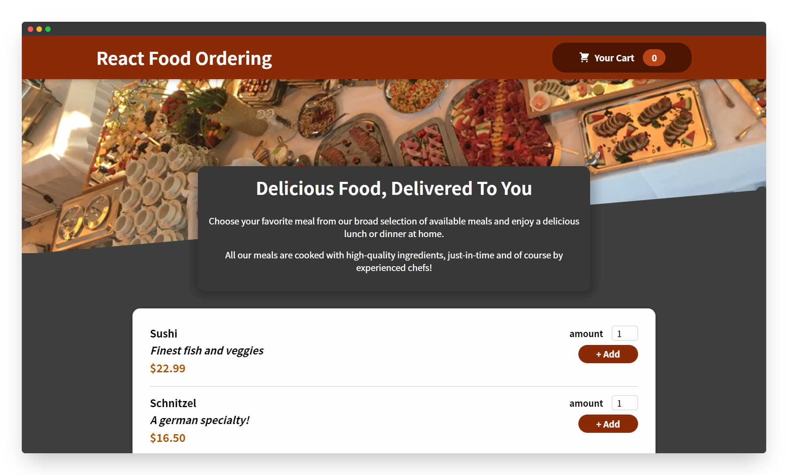
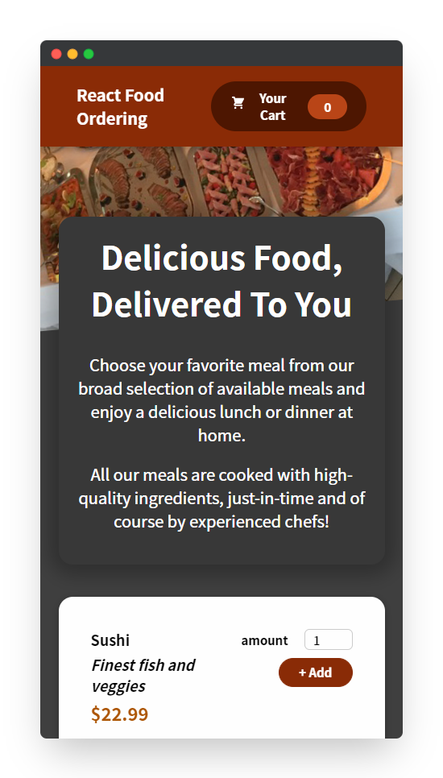
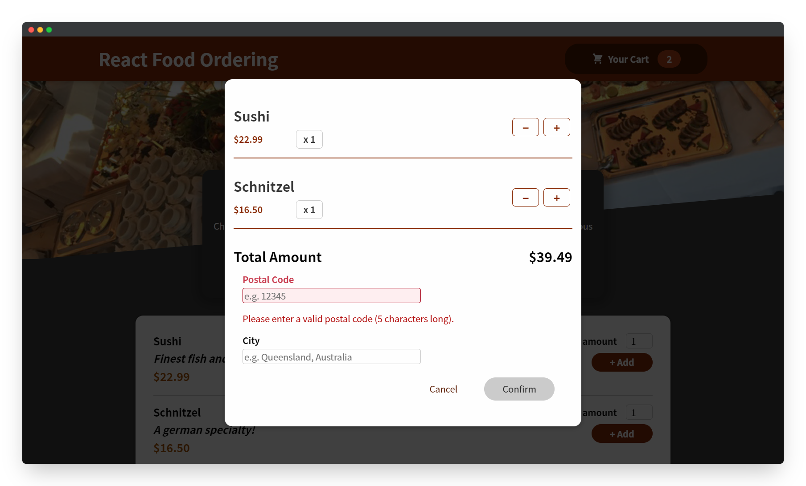
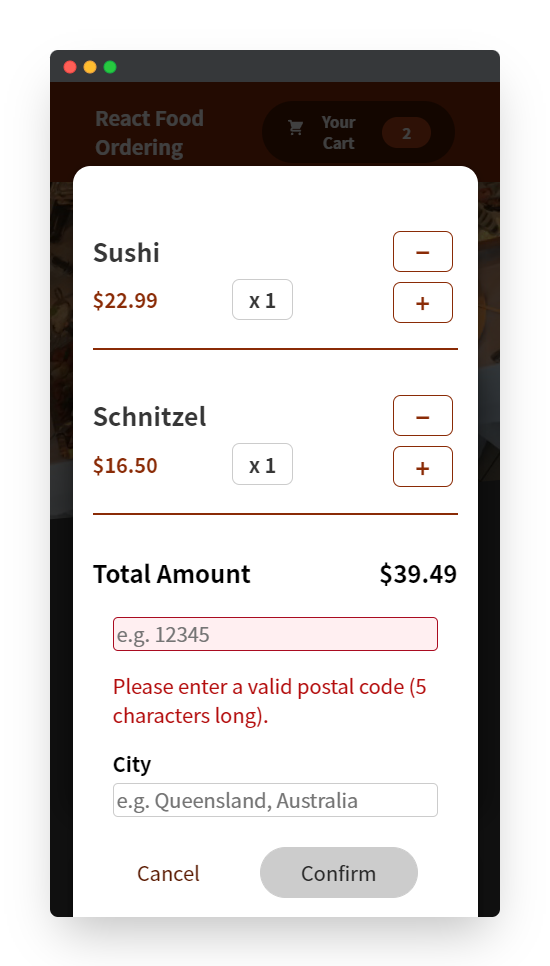

<!--
*** Thanks for checking out the react-food-ordering. If you have a suggestion
*** that would make this better, please fork the repo and create a pull request
*** or simply open an issue with the tag "enhancement".
*** Thanks again! Now go create something AMAZING! :D
***
*** To avoid retyping too much info. Do a search and replace for the following:
*** github_username (that is "windsuzu"), repo_name (that is "react-food-ordering"), project_title, project_description
-->

<!-- [![Issues][issues-shield]][issues-url] -->
<!-- [![PR Welcome][pr-welcome-shield]](#contributing) -->
[![Contributors][contributors-shield]][contributors-url]
[![MIT License][license-shield]][license-url]
[![Author][author-shield]][author-url]
[![LinkedIn][linkedin-shield]][linkedin-url]

<!-- PROJECT LOGO -->
 

  

  <h3 align="center">React Food Ordering</h3>

  

    A food ordering application built with react.js. 
     
    <a href="https://windsuzu.github.io/react-food-ordering">View Demo</a>
    ·
    <a href="https://github.com/windsuzu/react-food-ordering/issues">Report Bug</a>
    ·
    <a href="https://github.com/windsuzu/react-food-ordering/issues">Request Feature</a>
  

Table of Contents

* [About](#about)
* [Getting Started](#getting-started)
  * [Installation](#installation)
* [Usage](#usage)
* [Roadmap](#roadmap)
* [Contributing](#contributing)
* [License](#license)
* [Contact](#contact)
* [Acknowledgements](#acknowledgements)

---

<!-- ABOUT THE PROJECT -->
## About

<table>
<tr>
<td>

**React Food Ordering** 展示 React.js 中除了 `useState`, `useEffect`, `useRef` 以外的進階概念，例如:

1. **`useReducer`** 使用時機
   * 當 `useState` 多到很難管理
   * 當一個狀態有太多種行動類型 (action type) 
   * 當狀態之間有一定的關聯性
2. **`useContext`** 使用時機
   * 當 `state lifting` 變得不方便
   * 當傳遞 props 需要經過多個 components
3. **`React.forwardRef`** 使用時機
   * 當你想將在 custom component 上使用 `useRef`
4. **`useCallback`, `useMemo`** 使用時機
   * 當你想讓 function 或 data 只因特定的依賴改變而刷新 (或是不被輕易刷新)
   * 當你只用 `React.memo` 無法處理刷新問題
5. **`Custom Hooks`** 使用時機
   * 當某些 state 的處理過於複雜又需要大量重複使用
   * 例如 form validations, http requests
   * Maybe you don't need to reinvent the wheel [[useHttp]](https://github.com/ava/use-http) [[react-hook-form]](https://github.com/react-hook-form/react-hook-form)

**Built With**

* HTML5, CSS3, Javascript ES6
* React.js
* Styled Components

**[DEMO]** : https://windsuzu.github.io/react-food-ordering

</td>
</tr>
</table>

---

## Features

### 🥪 useReducer

* 
* 
* 

### 🪜 useContext

*  
* 
* 

### 🪱 React.forwardRef

* 
* 
* 

### 🪝 Custom Hooks

<table><tr><td>

#### 🕸️ useHttp

* 
* 
* 

#### ✍️ useInput

* 
* 
* 

</td></tr></table>

---

## Preview

  
  

  
  

---

## License

Distributed under the MIT License. See [LICENSE](https://github.com/windsuzu/react-food-ordering/blob/main/LICENSE) for more information.

## Contact

Reach out to the maintainer at one of the following places:

* [GitHub discussions](https://github.com/windsuzu/react-food-ordering/discussions)
* The email which is located [in GitHub profile](https://github.com/windsuzu)

## Acknowledgements

* [Maximilian Schwarzmüller](https://www.udemy.com/user/maximilian-schwarzmuller/)

[contributors-shield]: https://img.shields.io/github/contributors/windsuzu/react-food-ordering.svg?style=for-the-badge
[contributors-url]: https://github.com/windsuzu/react-food-ordering/graphs/contributors
[issues-shield]: https://img.shields.io/github/issues/windsuzu/react-food-ordering.svg?style=for-the-badge
[issues-url]: https://github.com/windsuzu/react-food-ordering/issues
[license-shield]: https://img.shields.io/github/license/windsuzu/react-food-ordering.svg?style=for-the-badge&label=license
[license-url]: https://github.com/windsuzu/react-food-ordering/blob/main/LICENSE
[linkedin-shield]: https://img.shields.io/badge/-LinkedIn-black.svg?style=for-the-badge&logo=linkedin&colorB=555
[linkedin-url]: https://linkedin.com/in/windsuzu
[pr-welcome-shield]: https://shields.io/badge/PRs-Welcome-ff69b4?style=for-the-badge
[author-shield]: https://shields.io/badge/Made_with_%E2%9D%A4_by-windsuzu-F4A92F?style=for-the-badge
[author-url]: https://github.com/windsuzu
